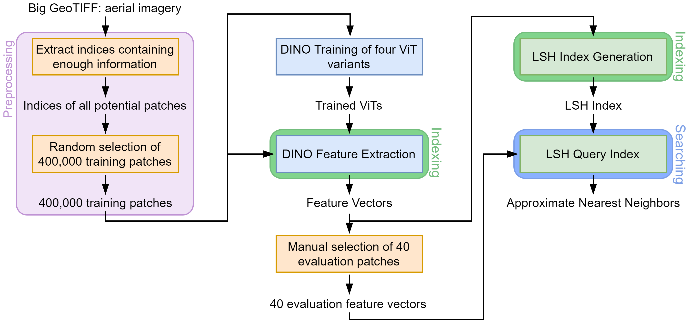

# RIS With DINO And LSH

This repository contains the code I wrote for my bachelor thesis: "Combining Deep Feature Extraction with Locality-Sensitive Hashing for Reverse Image Search".
It implements a two-step pipeline:
1. A Vision Transformer (ViT) trained with the [`DINO framework`](https://github.com/facebookresearch/dino) on unlabeled aerial data to generate feature vectors from images.
2. Locality-Sensitive Hashing (LSH) with [`FALCONN`](https://github.com/FALCONN-LIB/FALCONN) to find near neighbors quickly.

## Code Structure

<div align="center">
    
</div>

```
├── LICENSE
├── README.md
├── requirements.txt
├── notebooks
│   ├── 0_Data_Inspection.ipynb
│   ├── 1_Data_Preprocessing_Get_Information_Indices.ipynb
│   ├── 2_Data_Preprocessing_Store_Random_Patches.ipynb
│   ├── 3_DINO_Training.ipynb
│   ├── 4_DINO_Extract_Features.ipynb
│   ├── 5_LSH_Index.ipynb
│   ├── 6_DINO_Losses_Evaluation.ipynb
│   ├── 7_Nearest_Neighbors_Evaluation.ipynb
│   ├── 8_Nearest_Neighbor_Example_Patches.ipynb
│   └── 9_Visualize_Attention.ipynb
│
├── src
│   ├── __init__.py
│   │
│   ├── data
│   │   ├── denmark_dataset.py
│   │   └── dataset_utility.py
│   │
│   ├── models
│   │   ├── train_model.py
│   │   ├── vision_transformer.py
│   │   ├── predict_model.py
│   │   ├── lsh_nn.py
│   │   └── model_utility.py
│   │
│   └── visualization
│       ├── visualize_attention.py
│       └── visualization_utility.py
│
├── trained_models
│   ├── losses.csv
│   ├── runtimes.csv
│   ├── nn_precision_evaluation.csv
│   └── <MODEL> {tiny, tiny_longer, small, small_pretrained}
│       └── log.txt
│
├── calculations/Example_Calculations.ipynb
│
└── figures
    ├── attention_heads
    └── nearest_neighbors
        ├── houses_nn.png
        ├── example_patches.png
        ├── easy_top_results.png
        ├── hard_results.png
        └── fp_results.png
```

### [LICENSE](LICENSE)
File containing the Apache 2.0 license.

### [README.md](README.md)
The file you are currently reading. Explains the project and its structure.

### [requirements.txt](requirements.txt)
Summary of all imports to reproduce the environment.

### [notebooks/0_Data_Inspection.ipynb](notebooks/0_Data_Inspection.ipynb)
Obtain some general information about the GeoTIFF file containing all visual information.

### [notebooks/1_Data_Preprocessing_Get_Information_Indices.ipynb](notebooks/1_Data_Preprocessing_Get_Information_Indices.ipynb)
Splits the whole GeoTIFF file into patches (512 x 512 px) and stores the indices of patches containing enough information (at least 90%).
Generates `trained_models/all_indices.npy`.

### [notebooks/2_Data_Preprocessing_Store_Random_Patches.ipynb](notebooks/2_Data_Preprocessing_Store_Random_Patches.ipynb)
Generates a subset of 400,000 image patches. And stores their content on SSD where it can be accessed faster during model training.
Generates `trained_models/random_indices.npy`.

### [notebooks/3_DINO_Training.ipynb](notebooks/3_DINO_Training.ipynb)
Trains different ViT variants with the DINO framework.
Generates `trained_modes/<MODEL>/checkpoint.pth` and `trained_modes/<MODEL>/log.txt`.

### [notebooks/4_DINO_Extract_Features.ipynb](notebooks/4_DINO_Extract_Features.ipynb)
Uses different ViT variants to generate feature vectors from the images.
Runtimes summarized in `trained_models/runtimes.csv`.
Generates `trained_modes/<MODEL>/features.npy`.

### [notebooks/5_LSH_Index.ipynb](notebooks/5_LSH_Index.ipynb)
Generates the LSH index structure and uses it to perform an ANN-search for some example image patches.
Runtime experiments summarized in `trained_models/runtimes.csv`.
Generates `trained_models/nn_query_indices.npy`, `trained_modes/<MODEL>/nn_easy_candidates.npy`, `trained_modes/<MODEL>/nn_medium_candidates.npy`, and `trained_modes/<MODEL>/nn_hard_candidates.npy`.

### [notebooks/6_DINO_Losses_Evaluation.ipynb](notebooks/6_DINO_Losses_Evaluation.ipynb)
Plots the losses of the model variants.
Generates `trained_models/losses.csv`.

### [notebooks/7_Nearest_Neighbors_Evaluation.ipynb](notebooks/6_DINO_Losses_Evaluation.ipynb)
Used to evaluate the precision of the nearest neighbor results.
Generates `figures/nearest_neighbors/example_patches.png`.

### [notebooks/8_Nearest_Neighbor_Example_Patches.ipynb](notebooks/8_Nearest_Neighbor_Example_Patches.ipynb)
Generates visualizations of parts of the nearest neighbor evaluation results.
Generates `figures/nearest_neighbors/houses_nn.png`, `figures/nearest_neighbors/easy_top_results.png`, `figures/nearest_neighbors/hard_results.png`, and `figures/nearest_neighbors/fp_results.png`.

### [notebooks/9_Visualize_Attention.ipynb](notebooks/9_Visualize_Attention.ipynb)
Generates visualizations of the models' attention heads.
Generates figures in directory `figures/attention_heads/`

### [src/data/denmark_dataset.py](src/data/denmark_dataset.py)
Defines the class `DenmarkDataset` used for DINO training.

### [src/data/dataset_utility.py](src/data/dataset_utility.py)
Utility functions to work with a GeoTIFF file.

### [src/models/train_model.py](src/models/train_model.py])
DINO training procedure.

### [src/models/vision_transformer.py](src/models/vision_transformer.py)
Defines the architecture of the ViT variants.

### [src/models/predict_model.py](src/models/predict_model.py)
Uses the trained DINO model to generate the feature vectors.

### [src/models/lsh_nn.py](src/models/lsh_nn.py)
Uses `FALCONN` for LSH to perform an ANN-search.

### [src/models/model_utility.py](src/models/model_utility.py)
Utility functions for model training.

### [src/visualization/visualize_attention.py](src/visualization/visualize_attention.py)
Generates images that visualize the model's attention heads.

### [src/visualization/visualization_utility.py](src/visualization/visualization_utility.py)
Utility functions to generate an image containing multiple sub-images.

### [trained_models/losses.csv](trained_models/losses.csv)
Summary of losses of the model variants.
Generated by `notebooks/6_DINO_Losses_Evaluation.ipynb`.

### [trained_models/runtimes.csv](trained_models/runtimes.csv)
Summarizes runtimes of `notebooks/4_DINO_Extract_Features.ipynb` and `notebooks/5_LSH_Index.ipynb`.

### [trained_models/nn_precision_evaluation.csv](trained_models/nn_precision_evaluation.csv)
Summarizes nearest neighbor precision evaluation results based on `notebooks/7_Nearest_Neighbors_Evaluation.ipynb`.

### (Not part of repo) trained_models/all_indices.npy
Contains indices of *all* patches containing information.
Generated by `notebooks/1_Data_Preprocessing_Get_Information_Indices.ipynb`.

### (Not part of repo) trained_models/random_indices.npy
Contains a subset of 400,000 image patches used as the dataset.
Generated by `notebooks/2_Data_Preprocessing_Store_Random_Patches.ipynb`

### (Not part of repo) trained_models/nn_query_indices.npy
Indices of image patches used for evaluating the pipelines' performances.
Generated by `notebooks/5_LSH_Index.ipynb`.

### trained_modes/<MODEL>/log.txt
Log of model training: training loss, learning rate, weight decay and epoch.
Generated by `notebooks/3_DINO_Training.ipynb`.

### (Not part of repo) trained_modes/<MODEL>/checkpoint.pth
Model parameters of last model checkpoint.
Generated by `notebooks/3_DINO_Training.ipynb`.

### (Not part of repo) trained_modes/<MODEL>/features.npy
Feature vectors of given model for all image patches with indices given by `trained_models/random_indices.npy`.
Generated by `notebooks/4_DINO_Extract_Features.ipynb`.

### (Not part of repo) trained_modes/<MODEL>/nn_easy_candidates.npy
Near neighbors returned by the pipeline for the `Easy` queries.
Generated by `notebooks/5_LSH_Index.ipynb`.

### (Not part of repo) trained_modes/<MODEL>/nn_medium_candidates.npy
Near neighbors returned by the pipeline for the `Medium` queries.
Generated by `notebooks/5_LSH_Index.ipynb`.

### (Not part of repo) trained_modes/<MODEL>/nn_hard_candidates.npy
Near neighbors returned by the pipeline for the `Hard` queries.
Generated by `notebooks/5_LSH_Index.ipynb`.

### [calculations/Example_Calculations.ipynb](calculations/Example_Calculations.ipynb)
The example calculations for Hyperplane LSH and Spherical LSH on pages 22 and 24 of the thesis.

### [figures/attention_heads/](figures/attention_heads/)
Visualizations of the last layer's attention heads of every ViT variant for an image patch showing a wind turbine.
Basis for Figure 14 of the thesis.
Generated by `notebooks/9_Visualize_Attention.ipynb`.

### [figures/nearest_neighbors/houses_nn.png](figures/nearest_neighbors/houses_nn.png)
Query image showing houses and 49 near neighbors returned by the `Tiny` pipeline.
Figure 1 of the thesis.
Generated by `notebooks/8_Nearest_Neighbor_Example_Patches.ipynb`

### [figures/nearest_neighbors/example_patches.png](figures/nearest_neighbors/example_patches.png)
All images used for evaluation.
Figure 13 of the thesis.
Generated by `notebooks/7_Nearest_Neighbors_Evaluation.ipynb`

### [figures/nearest_neighbors/easy_top_results.png](figures/nearest_neighbors/easy_top_results.png)
Query images classified as `Easy` and their four nearest neighbors returned by the `Tiny` pipeline.
Figure 18 of the thesis.
Generated by `notebooks/8_Nearest_Neighbor_Example_Patches.ipynb`

### [figures/nearest_neighbors/hard_results.png](figures/nearest_neighbors/hard_results.png)
Selection of query images classified as `Medium` and `Hard` and selected near neighbors returned by the pipelines.
Figure 19 of the thesis.
Generated by `notebooks/8_Nearest_Neighbor_Example_Patches.ipynb`

### [figures/nearest_neighbors/fp_results.png](figures/nearest_neighbors/fp_results.png)
Query images and selected false positive results returned by the pipelines.
Figure 20 of the thesis.
Generated by `notebooks/8_Nearest_Neighbor_Example_Patches.ipynb`


## License
This repository is released under the Apache 2.0 license as found in the [LICENSE](LICENSE) file.
